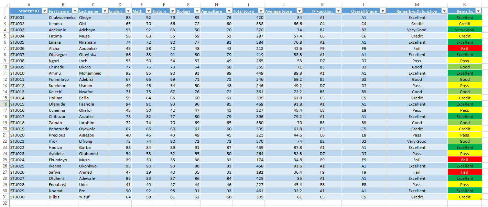

# 📊 From grades to insights: Leveraging Excel for smarter result analysis

Teachers handle more than just numbers as every grade carries a story of effort, struggle, and achievement. 
Instead of manually collating results, Microsoft Excel can transform raw scores into meaningful insights with ease. 
This worksheet showcases how simple formulas and conditional formatting can streamline result analysis.

## 🔍 Key Features in this worksheet

### ✅ **Automated calculations**
With formulas like `=SUM()` and `=AVERAGE()`, calculating total and average scores becomes effortless. No more manual tallying or second-guessing results

### 🎨 **Instant performance insights**
Conditional formatting highlights student performance:  
- 🟩 Green for top scorers  
- 🟨 Yellow for mid-range achievers  
- 🟥 Red for students needing extra support  

A single glance now provides a deeper understanding of performance trends.

### 🏅 **Fair, consistent grading with IF Statements**
Using `=IF()`, this worksheet assigns **standardized grades** based on score ranges:
- `A1 (Excellent)` for 75-100%
- `B2-B3 (Very Good/Good)` for 65-74%
- `C4-C6 (Credit)` for 55-64%
- `D7-E8 (Pass)` for 45-54%
- `F9 (Fail)` for below 40%

No more subjective remarks. Grading is **accurate and fair** across all students

### 📊 **Data organization & trend spotting**
Sorting and filtering allow teachers to:
- **Identify top-performing students** (e.g., Chukwuemeka and Olamide's consistent excellence)  
- **Pinpoint students needing subject-specific support** (e.g., Aisha’s struggles in History)  
- **Analyze grade distribution** for broader educational strategies  

## 🚀 **The impact of digital tools for teachers**
This Excel worksheet isn't just about numbers. It helps educators **see beyond the grades**, **focus on individual student progress**, and **make data-driven decisions**.

Excel saves time, reduces errors, and makes result analysis smarter. For teachers, that means more time spent **where it matters most—helping students succeed**. 🎯

---

🔗 **Would you need me to analyse data for you and provide meaningful insights?** 
Do not hesitate to reach me on the contact details available on my profile

## Thank You

#EdTech #MicrosoftExcel #TeacherTools #DataDrivenEducation

